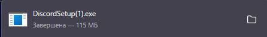
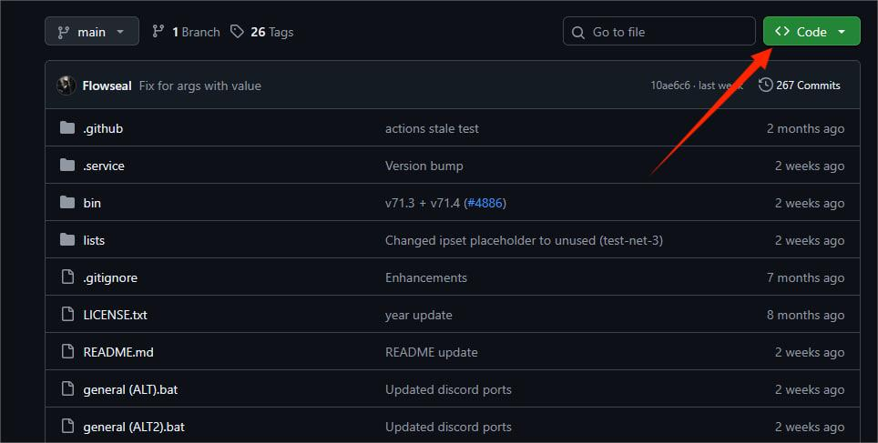
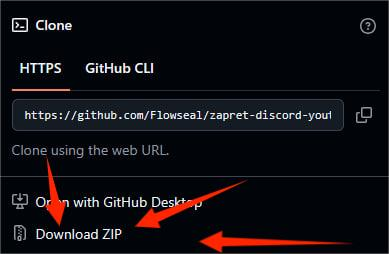
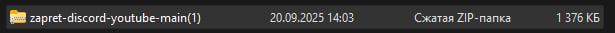
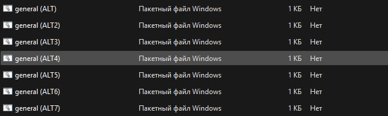

# Discord
<!DOCTYPE html>
<html lang="en">
<head>
    <meta charset="UTF-8">
    <meta name="viewport" content="width=device-width, initial-scale=1.0">
    <link rel="stylesheet" href="Dis.css">
    <title>Discord</title>
</head>
<body>
    <h1 class="general">Установка Discord и zapret</h1>
    
1. Установка Discord

    
Переходим по <a href="https://discord.com/">ссылки</a> и нажимаем Download for Windows

    
    
После скачивания нажимаем и устанавливам как обучную программу

    
2. Установка zapret

    
Переходим по <a href="https://github.com/Flowseal/zapret-discord-youtube">ссылки</a> и следуем инструкции

    
Нажимаем на зелёную кнопку Code

    
    
Нажимаем на Download ZIP

    
    
После установки переходим в проводник потом в загрузки

    
    
Нажимаем правой кнопкой мыше по папке и потом нажимаем "Извлеч всё" в загрузки

    
Потом нажимает на любой который работет

    
    
Дальше заходим в Discrod и регистрируемся

</body>
</html>
